## Markus Tacker

:::::::::::::: {.columns}

::: {.column width=40%}

{width=50%}

:::

::: {.column width=48%}

Senior R&D Engineer, Nordic Semiconductor, Trondheim

<small>**Software crafter. Code donor. Mentor. Speaker. Conference & Community
builder. Camper.**</small>

[\@coderbyheart](https://twitter.com/coderbyheart)

<small>Pronouns: he/him</small>

:::

::::::::::::::

### My work at Nordic Semiconductor

#### 2017

First full time cloud engineer working on [nrfcloud.com](https://nrfcloud.com/)
building Software-as-a-service (Saas) offering.

#### 2019

Application Group to work on on open-source end-to-end examples of real world
IoT products.

## Agenda

- What is _IoT_?
  - Protocols for the Internet of Things.
- What is _serverless_?
  - Why I like _serverless_
  - Downsides of _serverless_
- AWS Lambda explained.
- IoT <3 _serverless_
  - Architecture Example:  
    store and retrieve temperature data
- Learning resources

## What is _IoT_?

- Computing devices (_things_) connected to the internet
- either through a gateway (PC, phone)
- or directly, using cellular IoT (wireless radio)

### Benefits of _IoT_

Enable new aproaches to conserve and protect resources and make smarter,
real-time data-driven decisions.

:::::::::::::: {.columns}

::: {.column}

[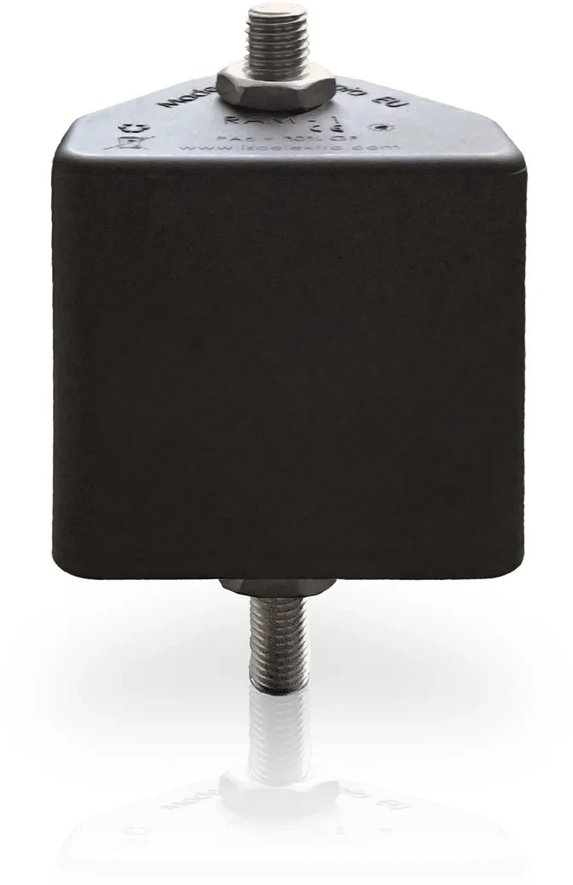{width=40%}](https://www.nordicsemi.com/News/2021/02/IRNAS-employs-nRF9160-and-nRF52811)

<small>Power transmission tower which detects failures and allows to react
immediately and prevent for example wildfires cause by electrical fire.</small>

:::

::: {.column}

[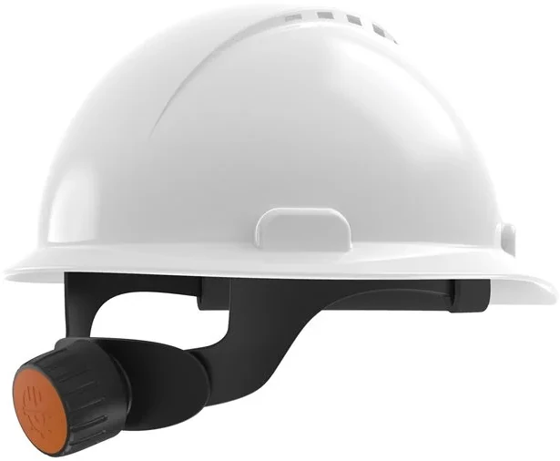{width=60%}](https://www.nordicsemi.com/News/2021/01/Wirepas-Mesh-hard-hat-sensor-locates-wearer-across-large-sites-and-reports-activity-incidents)

<small>Hard hat sensor locates wearer across large sites and reports
activity/incidents.</small>

:::

::::::::::::::

### Protocols for the Internet of Things

- ultra shortrange: cm (NFC, ...)
- shortrange: m (Bluetooth, Zigbee, WiFi, ...)
- long range: km (LoRa, LTE, ...)

### Wireless radio protocols


:::notes

The nRF9160 supports two cellular networking protocols: LTE-M and NB-IoT.
Fundamentally they both provide IP connectivity to your device, however they are
significant differences, which are important to consider when developing your
IoT product.

See
[this comparison](https://www.nordicsemi.com/Products/Low-power-cellular-IoT)

:::

### 

- 375 kbps downlink, 300 kbps uplink
- ~100 kbps application throughput running IP
- supports roaming (same as LTE)
- typically uses frequency bands above 2 Ghz
- ms-latency

:::notes

LTE-M (also known as Cat-M1) is designed for low power applications requiring
medium throughput. It has a narrower bandwidth of 1.4 MHz compared to 20 MHz for
regular LTE, giving longer range, but less throughput. The throughput is 375
kbps downlink and 300 kbps uplink, providing approximately 100 kbps application
throughput running IP. It is suitable for TCP/TLS end-to-end secure connections.
Mobility is fully supported, using the same cell handover features as in regular
LTE. It is currently possible to roam with LTE-M, meaning it is suitable for
applications that will operate across multiple regions. The latency is in the
millisecond range offering real time communication for time-critical
applications.

:::

### 

- 60 kbps downlink, 30 kbps uplink
- typically uses frequency bands below 2 Ghz
- no roaming support (some Telcos do offer custom solution)
- good indoor/underground penetration characteristics
- long range

:::notes

NB-IoT (also known as Cat-NB1) is a narrowband technology standard that does not
use a traditional LTE physical layer, but is designed to operate in or around
LTE bands and coexist with other LTE devices. It has a bandwidth of 200 kHz,
giving it longer range and lower throughput compared to LTE-M and regular LTE.
The throughput is 60 kbps downlink and 30 kbps uplink. It is suitable for
static, low power applications requiring low throughput.

:::

### Comparison

:::::::::::::: {.columns}

::: {.column}

#### LTE-M

<small>for medium throughput applications requiring low power, low latency
and/or mobility</small>

- asset tracking
- wearables
- medical
- POS
- home security

:::

::: {.column}

#### NB-IoT

<small>for static, low throughput applications requiring low power and long
range</small>

- smart metering
- smart agriculture
- smart city

:::

::::::::::::::

:::notes

LTE-M is perfect for medium throughput applications requiring low power, low
latency and/or mobility, like asset tracking, wearables, medical, POS and home
security applications.

NB-IoT is perfect for static, low throughput applications requiring low power
and long range, like smart metering, smart agriculture and smart city
applications. It also provides better penetration in, for example, cellars and
parking garages compared to LTE-M.

:::

### Application data

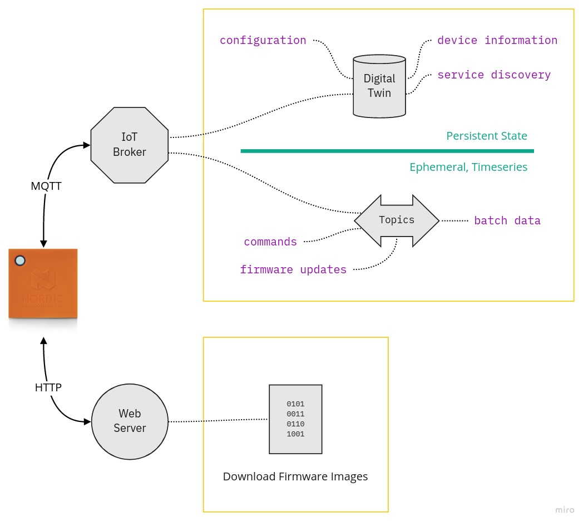{width=50%}

Typical IoT Data Protocol Configuration

:::notes

[Source](https://miro.com/app/board/o9J_kjPVxw8=/)

What you see here is a typical configuration for cellular IoT devices.

:::

### The four kinds of data

1. Device State
1. Device Configuration
1. Past Data
1. Firmware Updates

### 1. Device State

:::::::::::::: {.columns}

::: {.column}

- **sensor readings** (like position, temperature)
- information about its **health** (like battery level)

Because the latest state should be immediately visible: buffer data in a
_Digital&nbsp;Twin_.

:::

::: {.column}


:::

::::::::::::::

:::notes

A device needs to send its sensor readings (like position, temperature) and
information about its health to the backend, first an foremost is the battery
level a critical health indicator. This data is considered the device state.

Because we want to always be able to quickly see the latest state of the device,
a digital twin can be used to store this state on the backend side: whenever the
device sends an update, the digital twin is updated. This allows an application
to access the most recent device state immediately without needing to wait for
the device to connect and publish its state.

:::

### 2. Device Configuration

:::::::::::::: {.columns}

::: {.column}

- change behaviour of device in real time (e.g. sensor sensititiy, timeouts)
- configure physical state (e.g. _locked_ state of a door lock)
- cloud side _owns_ device state (because the device may lose power and state)

:::

::: {.column}


:::

::::::::::::::

:::notes

Depending on the product we might also want to change the device configuration.
This could on the one hand be use during development to tweak the aforementioned
behavior using variables instead of pushing a new firmware over the air to the
device. We observe firmware sizes of around 250 KB which will, even when
compressed, be expensive because it will take a device some time to download and
apply the updated, not to mention the costs for transferring the firmware update
over the cellular network. Especially in NB-IoT-only deployments is the data
rate low. Updating a fleet of devices with a new firmware involves orchestrating
the roll-out and observing for faults. All these challenges lead to the need to
be able to **configure the device**, which allows to tweak the behavior of the
device until the inflection point is reached: battery life vs. data granularity.
Interesting configuration options are for example the sensitivity of the motion
sensor: depending on the tracked subject what is considered "movement" can vary
greatly. Various timeout settings have an important influence on power- and
data-consumption: the time the device waits to acquire a GPS fix, or the time it
waits between sending updates when in motion.

On the other hand is device configuration needed if the device controls
something: imaging a smart lock which needs to manipulate the state of a
physical lock. The backend needs a way to tell the device which state that lock
should be in, and this setting needs to be persisted on the backend, since the
device could lose power, crash or otherwise lose the information if the lock
should be open or closed.

Here again is the digital twin used on the cloud side to store the latest
desired configuration of the device immediately, so the application does not
have to wait for the device to be connected to record the configuration change.
The implementation of the digital twin then will take care of sending only the
latest required changes to the device (all changes since the device did last
request its configuration are combined into one change) thus also minimizing the
amount of data which needs to be transferred to the device.

:::

### 3. Past Data

Cellular IoT devices need to send **data about past events**: they will be
offline most of the time.

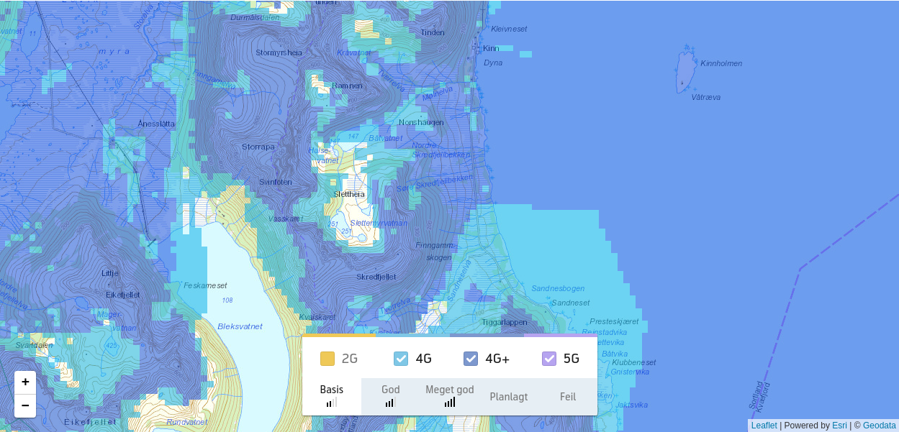

:::notes

[Source](https://www.telenor.no/privat/dekning/)

Imagine a reindeer tracker which tracks the position of a herd. If position
updates are only collected when a cellular connection can be established there
will be an interesting observation: the reindeers are only walking along ridges,
but never in valleys. The reason is not because they don't like the valley, but
because the cellular signal does not reach deep down into remote valleys. The
GPS signal however will be received there from the tracker because satellites
are high on the horizon and can send their signal down into the valley.

There are many scenarios where cellular connection might not be available or
unreliable but reading sensors work. Robust ultra-mobile IoT products therefore
must make this a normal mode of operation: the absence of a cellular connection
must be treated as a temporary condition which will eventually resolve and until
then business as usual ensues. This means devices should keep measuring and
storing these measures in a ring-buffer or employ other strategies to decide
which data to discard once the memory limit is reached.

Once the device is successfully able to establish a connection it will then
(after publishing its most recent measurements) publish past data in batch.

On a side note: the same is true for devices that control a system. They should
have built-in decision rules and must not depend on an answer from a cloud
backend to provide the action to execute based on the current condition.

:::

### 4. Firmware Updates

- 2-3 magnitudes larger than a control message (~250 KB)
- notification via control channel (MQTT)
- download via data channel (HTTP): less overhead, supports resume

:::notes

Arguably a firmware update over the air can be seen as configuration, however
the size of a typical firmware image (250 KB) is 2-3 magnitudes larger than a
control message. Therefore it can be beneficial to treat it differently.
Typically an update is initiated by a configuration change, once acknowledged by
the device will initiate the firmware download. The download itself is done out
of band using not MQTT but HTTP(s) to reduce overhead.

Additionally firmware updates are so large compared to other messages that the
device may suspend all other operation until the firmware update has been
applied to conserve resources.

:::

### Data protocols

- JSON
- Alternatives to JSON
  - Protocol buffers
  - Flatbuffers
  - CBOR

:::notes

Let's look at the "default" protocol for encoding Application data and what
alternatives exist to reduce the amount of data needed to transmit a typical
device message: a GPS location.

:::

### JSON

```json
{
  "v": {
    "lng": 10.414394,
    "lat": 63.430588,
    "acc": 17.127758,
    "alt": 221.639832,
    "spd": 0.320966,
    "hdg": 0
  },
  "ts": 1566042672382
}
```

"default" data protocol for IoT
([AWS](https://docs.aws.amazon.com/iot/latest/developerguide/iot-device-shadows.html),
[Azure](https://docs.microsoft.com/en-us/azure/iot-hub/iot-hub-devguide-device-twins),
[Google Cloud](https://cloud.google.com/iot/docs/how-tos/config/getting-state#api))

:::::::::::::: {.columns}

::: {.column}

👍 human readable  
👍 schema-less (self-describing)

:::

::: {.column}

👎 overhead

:::

::::::::::::::

:::notes

JSON offers very good support in tooling and is human readable. Especially
during development its verbosity is valuable.

:::

### Possible Optimizations

GPS location message

:::::::::::::: {.columns}

::: {.column}

```json
{
  "v": {
    "lng": 10.414394,
    "lat": 63.430588,
    "acc": 17.127758,
    "alt": 221.639832,
    "spd": 0.320966,
    "hdg": 0
  },
  "ts": 1566042672382
}
```

:::

::: {.column}

<br/>

```
02 36 01 37 51 4b 73 2b
d4 24 40 09 68 06 f1 81
1d b7 4f 40 11 68 cd 8f
bf b4 20 31 40 19 e6 5d
f5 80 79 b4 6b 40 21 1a
30 48 fa b4 8a d4 3f 29
00 00 00 00 00 00 00 00
09 00 e0 cf ac f6 c9 76
42
```

:::

::::::::::::::

:::::::::::::: {.columns}

::: {.column}

JSON  
114 bytes  
<small>without newlines</small>

:::

::: {.column}

Protocol Buffers  
65 bytes (-42%)  
<small>[source](https://gist.github.com/coderbyheart/34a8e71ffe30af882407544567971efb)</small>

:::

::::::::::::::

:::notes

Consider this GPS message. It contains a lot of data which is intended for
humans, but not needed for machines sending or receiving the data.

The pure binary message would be transmitting only the 6 floats and 1 integer of
the message. However a strucured message format is always preferred because we
also want to ensure its integrity.

In JSON notation this document (without newlines) has 114 bytes. If the message
were to be transferred using for example Protocol Buffers the data can be
encoded with only 65 bytes (a 42% improvement).

See also:
[RION Performance Benchmarks](http://tutorials.jenkov.com/rion/rion-performance-benchmarks.html)

:::

### Protocol buffers

[developers.google.com/protocol-buffers](https://developers.google.com/protocol-buffers)

- send structured data in efficient binary format without overhead
- message format can be changed (ammended) without breaking existing clients
- small implementation for embedded devices exists:
  [nanopb](https://github.com/nanopb/nanopb)

:::notes

In the comparison on the previous slide we showed how using Protocol Buffers can
dramatically reduce the transferred data size, while keeping a typed message.

The implementation of Protocol Buffers is however quite big (for a resource
constrained device like the nRF9160), and no official encoder/decoder
implementation exists for C,
[inofficial does](https://github.com/protobuf-c/protobuf-c).

Flatbuffers is the best candidate with similar data savings.

Especially the ability to access members of a message directly in place makes it
ideal for memory-constrained devices: no need to create a second copy of the
received values.

It also offers flexibility during development is also supported because
FlatBuffers offers a schema-less (self-describing) version.

Unfortunately there is no official support in the nRF Connect SDK or Zephyr as
of now.

:::

### Flatbuffers

[google.github.io/flatbuffers](https://google.github.io/flatbuffers/)

- evolution of
  [Protocol Buffers](https://developers.google.com/protocol-buffers)
- **access a buffer without parsing**
- smaller library,
  [C implementation exists](https://github.com/dvidelabs/flatcc)
- wire format size
  [a little bigger](http://google.github.io/flatbuffers/flatbuffers_benchmarks.html)
  compared to Protocol Buffers
- schema-less (self-describing) messages are supported

:::notes

In the comparison on the previous slide we showed how using Protocol Buffers can
dramatically reduce the transferred data size, while keeping a typed message.

The implementation of Protocol Buffers is however quite big (for a resource
constrained device like the nRF9160), and no official encoder/decoder
implementation exists for C,
[inofficial does](https://github.com/protobuf-c/protobuf-c).

Flatbuffers is the best candidate with similar data savings.

Especially the ability to access members of a message directly in place makes it
ideal for memory-constrained devices: no need to create a second copy of the
received values.

It also offers flexibility during development is also supported because
FlatBuffers offers a schema-less (self-describing) version.

Unfortunately there is no official support in the nRF Connect SDK or Zephyr as
of now.

:::

### CBOR

[cbor.io](https://cbor.io/)

- maps JSON to binary structures
- zero configuration needed between exchanging parties
- support for embedded devices:
  [tinycbor](https://intel.github.io/tinycbor/current/)

:::notes

Therefore the best alternative to JSON right now is CBOR.

CBOR is standard for encoding JSON data in a set of binary structures. It
reduces volume by using more compact one byte values to replace two or more
punctuation marks.

:::

### CBOR: example

GPS location message

:::::::::::::: {.columns}

::: {.column}

```json
{
  "v": {
    "lng": 10.414394,
    "lat": 63.430588,
    "acc": 17.127758,
    "alt": 221.639832,
    "spd": 0.320966,
    "hdg": 0
  },
  "ts": 1566042672382
}
```

:::

::: {.column}

<br/>

```
A2 61 76 A6 63 6C 6E 67
FB 40 24 D4 2B 73 4B 51
37 63 6C 61 74 FB 40 4F
B7 1D 81 F1 06 68 63 61
63 63 FB 40 31 20 B4 BF
8F CD 68 63 61 6C 74 FB
40 6B B4 79 80 F5 5D E6
63 73 70 64 FB 3F D4 8A
B4 FA 48 30 1A 63 68 64
67 00 62 74 73 1B 00 00
01 6C 9F 6A CC FE
```

:::

::::::::::::::

:::::::::::::: {.columns}

::: {.column}

JSON  
114 bytes  
<small>without newlines</small>

:::

::: {.column}

CBOR  
86 bytes (-24%)  
<small>[source](http://cbor.me/)</small>

:::

::::::::::::::

:::notes

This shows the possible savings when encoding the GPS location message using
CBOR.

:::

### Summary: Data protocols

Look into denser data protocols!  
**JSON is for Humans.**

- devices always™ send the same structure:  
  no need to transmit it
- less data to send
  - less money spent on data (grows linear with № of devices)
  - less energy consumed = longer device lifetime
  - lower chance of failed transmit

### Transport protocols

- MQTT+TLS
- MQTT-SN+(D)TLS
- CoAP/LWM2M+(D)TLS

### MQTT+TLS

common protocol for "ecommerce" cloud vendors  
([AWS](https://docs.aws.amazon.com/iot/latest/developerguide/protocols.html),
[Azure](https://docs.microsoft.com/en-us/azure/iot-hub/iot-hub-devguide-protocols),
[Google Cloud](https://cloud.google.com/iot/docs/concepts/protocols))

- great fit for asynchronous, event oriented communication: MQTT is
  bidirectional pub/sub model
- overhead:
  - topic name in every MQTT package  
    № of topics per device: ~3
  - TLS handshake with AWS IoT broker: ~10 KB

:::notes

MQTT with TLS is the default protocol when using IoT offerings from "ecommerce"
cloud vendors like Amazon, Microsoft or Google. It's a great fit for the
event-driven communication in IoT and allows both sides to initiate
communication.

However the protocol overhead for both MQTT and TLS are substantial: the initial
handshake is large, and then every MQTT package contains repeated information.
The MQTT topic name is quite long (typical size is around 60 Byte), which could
actually be omitted.

:::

### MQTT-SN+(D)TLS

[MQTT-SN 1.2 Specification](https://www.oasis-open.org/committees/document.php?document_id=66091)

- optimized version designed specifically IoT
- supports UDP
- use numeric IDs instead of strings for topic names
- better offline support
- **not supported** by cloud vendors: needs a (stateful) Gateway

:::notes

MQTT-SN was specifically designed for IoT devices and tries to address the
issues mentioned earlier.

The main differences involve:

- Reducing the size of the message payload
- Removing the need for a permanent connection by using UDP as the transport
  protocol.

:::

### CoAP/LWM2M+(D)TLS

- common protocol in Telco clouds (Verizon’s Thingspace, AT&T’s IoT Platform)
- typically used for device management (carrier library)
- **not supported** by cloud vendors: needs a (stateful) Gateway.  
  Proof-of-concept AWS IoT-LwM2M Gateway:
  [github.com/coderbyheart/leshan-aws](https://github.com/coderbyheart/leshan-aws)

:::notes

This protocol is mostly used for device management. Especially LwM2M comes with
a large set of predefined operations (e.g. firmware update) and uses very
lightweight messaging. It also supports UDP out of the box which makes it an
ideal protoco for resource constraint devices.

However there is no out-of-the box support by ecommerce cloud vendors, so here
again one needs to operate a Gateway.

:::

### IoT connectivity summary

- no silver bullet - multiple _conflicting_ dimensions need to be considered
- highly depends on use case scenario
- ultra-low power relevant in all scenarios:
  - data = money
  - power consumption = money

## What is _serverless_?

Serverless \[architectures\] are application designs that \[...\] run in
**managed, ephemeral containers** on a “Functions as a Service” (FaaS) platform.

:::notes

Source: https://martinfowler.com/articles/serverless.html

:::

### Benefits

By using these ideas, \[...\] such architectures remove much of the need for a
traditional always-on server component.

\[They\] **may** benefit from significantly reduced operational cost,
complexity, and engineering lead time, at a cost of increased reliance on vendor
dependencies and comparatively immature supporting services.

Source:
[martinfowler.com/articles/serverless.html](https://martinfowler.com/articles/serverless.html)

### Why I like _serverless_

_Serverless computing allows me to focus on implementing the solution, and not
spend time on maintaining the infrastructure needed to execute it._

### or more practical

- build globally scalable solutions with a small team
- suprises are rare, allows me to go on vacation

:::notes

Going serverless allows me and a rather small team of engineers to build a
globally scalable software solution with a very high confidence in it's
scalability and an ease of mind during operations.

In the last years since I have been working fully serverless, I have not once
experienced a surprising event that impacted our production system.

Yes, we experience issues which gradually become more serious over time, but in
general it happens in a way that does not interfere with my vacation plans.

Serverless not only enables horizontal scalability, but allows to update each
component of the solution individually: the code for a lambda function can be
replaced without affecting other functions. This means no more waiting minutes
for a monolithic container to come up again after a fix has been deployed.

:::

### Horizontal Scalablity

- Serverless implementations depend on _stateless_, _event-driven_
  implementations.
- This allows to process as many requests as needed, in _parallel_.
- However, you have to deal with eventual consistency.

### Updating individual components

Instead of restarting the instance,  
I can update _an individual function_.

:::notes

Serverless not only enables horizontal scalability, but allows to update each
component of the solution individually: the code for a lambda function can be
replaced without affecting other functions. This means no more waiting minutes
for a monolithic container to come up again after a fix has been deployed.

:::

### Downsides of _serverless_

### Testability

- Testing cloud-native solutions really is a challenge.

:::notes

You can see my talk about testing cloud-native solutions here:
https://coderbyheart.com/it-does-not-run-on-my-machine/

:::

### Infrastructure is part of the solution

- More ceremony involved, defining infrastructure as code is now your job.

### Serverless is usually closed source

- Impossible to run it locally.

### Mindset shift

- Huge mindset shift from the classical application server model (LAMP, Tomcat,
  Rails), to a serverless, stateless, eventual consistent application
  development model.

## AWS Lambda explained

With [Lambda](https://aws.amazon.com/lambda/), you can run code virtually with
zero administration of the underlying infrastructure. You are responsible only
for the code that you provide Lambda, and the configuration of how Lambda runs
that code on your behalf.

:::notes

Sources for this section:

- https://docs.aws.amazon.com/lambda/latest/dg/welcome.html
- https://docs.aws.amazon.com/whitepapers/latest/security-overview-aws-lambda/

:::

### AWS Lambda _Hello World!_

```javascript
const AWS = require("aws-sdk");
const s3 = new AWS.S3();

exports.handler = async (event) => s3.listBuckets().promise();
```

### AWS Lambda execution

```javascript
const AWS = require("aws-sdk"); // Dependencies included in runtime
const s3 = new AWS.S3(); // Credentials provided by environment (based on role)

// event populated per request
exports.handler = async (event) => s3.listBuckets().promise();
// response is returned to invoker by runtime
```

### Supported runtimes

#### Built-in

Node.js, Python, Ruby, Java, Go, .NET Core

#### Custom runtimes

Anything that runs in Amazon Linux 2.

:::notes

- https://docs.aws.amazon.com/lambda/latest/dg/lambda-runtimes.html
- https://docs.aws.amazon.com/lambda/latest/dg/runtimes-custom.html
- Amazon Linux 2: https://aws.amazon.com/amazon-linux-2/

:::

### When should I use Lambda?

Lambda is best suited for shorter, event-driven workloads, since Lambda
functions run for up to 15 minutes per invocation.

### Other limits

- RAM: max 10 GB
- payload (event): max 6 MB
- source code size: max 25 MB / 10 GB container image
- open files: 1,024
- `/tmp` size: max 512 MB

### Scaling

- first invokation (event) creates a function instance
- stays active after response and waits to process additional events
- more instances are created if multiple events need processing at the same time
- instances are discared if number of events decreases

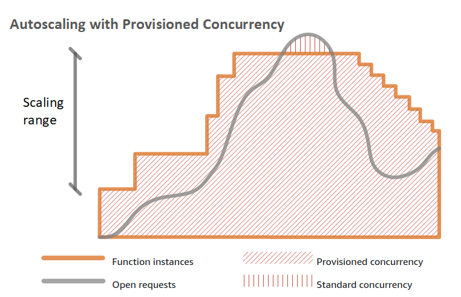{width=50%}

:::notes

https://docs.aws.amazon.com/lambda/latest/dg/invocation-scaling.html

The first time you invoke your function, AWS Lambda creates an instance of the
function and runs its handler method to process the event. When the function
returns a response, it stays active and waits to process additional events. If
you invoke the function again while the first event is being processed, Lambda
initializes another instance, and the function processes the two events
concurrently. As more events come in, Lambda routes them to available instances
and creates new instances as needed. When the number of requests decreases,
Lambda stops unused instances to free up scaling capacity for other functions.

:::

### Lambda execution environments

Lambda provides **function version level isolation**:

- reserved for a specific function version
  - no reuse across function versions, functions, or AWS accounts
- only one concurrent invocation at a time

:::notes

This means a single function which may have two different versions would result
in at least two unique execution environments.

Each execution environment may only be used for one concurrent invocation at a
time, and they may be reused across multiple invocations of the same function
version for performance reasons. Depending on a number of factors (for example,
rate of invocation, function configuration, and so on), one or more execution
environments may exist for a given function version. With this approach, Lambda
is able to provide function version level isolation for its customers.

Execution environments are continuously monitored and managed by Lambda, and
they may be created or destroyed for any number of reasons including, but not
limited to:

- A new invoke arrives and no suitable execution environment exists
- An internal runtime or Worker software deployment occurs
- A new provisioned concurrency configuration is published
- The lease time on the execution environment, or the Worker, is approaching or
  has exceeded max lifetime
- Other internal workload rebalancing processes

Source:
https://docs.aws.amazon.com/whitepapers/latest/security-overview-aws-lambda/lambda-executions.html

:::

### Execution environment

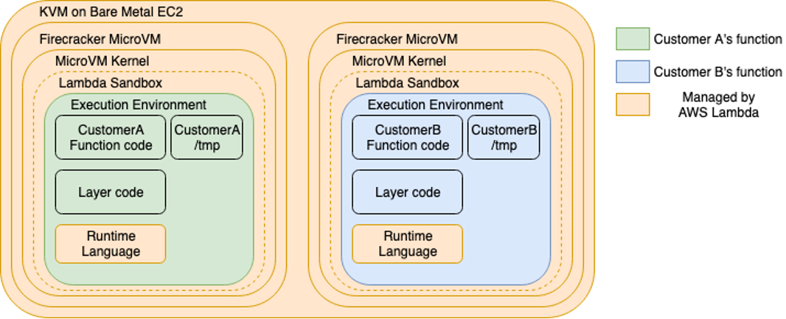{width=70%}

Execution environments are isolated from one another using several
container-like technologies. Amazon open-sourced their virtualization
technology, called [Firecracker](https://firecracker-microvm.github.io/).

:::notes

Lambda will create its execution environments on a fleet of Amazon EC2 instances
called AWS Lambda Workers. Workers are bare metalEC2 Nitro instances which are
launched and managed by Lambda in a separate isolated AWS account which is not
visible to customers. Workers have one or more hardware-virtualized Micro
Virtual Machines (MVM) created by Firecracker. Firecracker is an open-source
Virtual Machine Monitor (VMM) that uses Linux’s Kernel-based Virtual Machine
(KVM) to create and manage MVMs. It is purpose-built for creating and managing
secure, multi-tenant container and function-based services that provide
serverless operational models.

As a part of the shared responsibility model, Lambda is responsible for
maintaining the security configuration, controls, and patching level of the
Workers. The Lambda team uses Amazon Inspector to discover known potential
security issues, as well as other custom security issue notification mechanisms
and pre-disclosure lists, so that customers don’t need to manage the underlying
security posture of their execution environment.

Workers have a maximum lease lifetime of 14 hours. When a Worker approaches
maximum lease time, no further invocations are routed to it, MVMs are gracefully
terminated, and the underlying Worker instance is terminated. Lambda
continuously monitors and alarms on lifecycle activities of its fleet’s
lifetime.

All data plane communications to workers are encrypted using Advanced Encryption
Standard with Galois/Counter Mode (AES-GCM). Other than through data plane
operations, customers cannot directly interact with a worker as it hosted in a
network isolated Amazon VPC managed by Lambda in Lambda’s service accounts.

When a Worker needs to create a new execution environment, it is given
time-limited authorization to access customer function artifacts. These
artifacts are specifically optimized for Lambda’s execution environment and
workers. Function code which is uploaded using the ZIP format is optimized once,
and then is stored in an encrypted format using an AWS-managed key and AES-GCM.

Functions uploaded to Lambda using the container image format are also
optimized. The container image is first downloaded from its original source,
optimized into distinct chunks, and then stored as encrypted chunks using an
authenticated convergent encryption method which uses a combination of AES-CTR,
AES-GCM, and a SHA-256 MAC. The convergent encryption method allows Lambda to
securely deduplicate encrypted chunks. All keys required to decrypt customer
data is protected using customer-managed AWS KMS Customer Master Key (CMK). CMK
usage by the Lambda service is available to customers in AWS CloudTrail logs for
tracking and auditing.

Source:
https://docs.aws.amazon.com/whitepapers/latest/security-overview-aws-lambda/lambda-executions.html

See also:
https://docs.aws.amazon.com/whitepapers/latest/security-overview-aws-lambda/lambda-isolation-technologies.html

:::

### Execution environment lifecycle

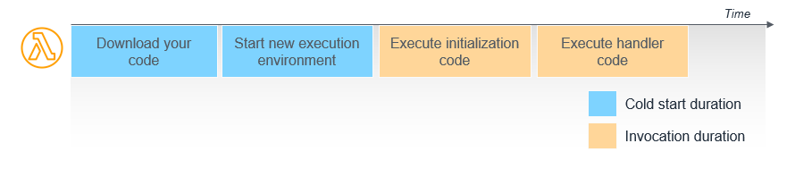

1. download the code for the function from S3 or ECR
2. create environment with the memory, runtime, and configuration specified
3. run any initialization code outside of the event handler
4. run the handler code.

:::notes

When the Lambda service receives a request to run a function via the Lambda API,
the service first prepares an execution environment. During this step, the
service downloads the code for the function, which is stored in an internal S3
bucket (or in Amazon ECR if the function uses container packaging). It then
creates an environment with the memory, runtime, and configuration specified.
Once complete, Lambda runs any initialization code outside of the event handler
before finally running the handler code.

In this diagram, the first two steps of setting up the environment and the code
are frequently referred to as a “cold start”. You are not charged for the time
it takes for Lambda to prepare the function but it does add latency to the
overall invocation duration.

After the execution completes, the execution environment is frozen. To improve
resource management and performance, the Lambda service retains the execution
environment for a non-deterministic period of time. During this time, if another
request arrives for the same function, the service may reuse the environment.
This second request typically finishes more quickly, since the execution
environment already exists and it’s not necessary to download the code and run
the initialization code. This is called a “warm start”.

Source:
https://docs.aws.amazon.com/lambda/latest/operatorguide/execution-environments.html

:::

### Hitting the cold start zone

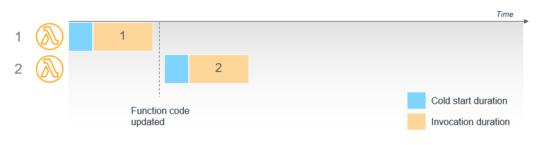

Lambda service retains the execution environment for a non-deterministic period
of time.

:::notes

The Lambda service retains the execution environment instead of destroying it
immediately after execution. There are also operational factors in the Lambda
services that influence the retention time.

While execution environment reuse is useful, you should not depend on this for
performance optimization. Lambda is a high availability service that manages
execution across multiple Availability Zones in an AWS Region. Depending upon
aggregate customer traffic, the service may load balance a function at any time.
As a result, it’s possible for a function to be invoked twice in a short period
of time, and both executions experience a cold-start due to this load
rebalancing activity.

Additionally, in the event that a Lambda function scales up due to traffic, each
additional concurrent invocation of the function requires a new execution
environment. This means that each concurrent execution experiences a cold-start,
even as existing concurrent functions may already be warm.

Finally, anytime you update the code in a Lambda function or change the
functional configuration, the next invocation results in a cold start. Any
existing environments running a previous version of the “Latest” alias are
reaped to ensure that only the new version of the code is used.

:::

### Cold start scenarios

### 6 simultaneous requests

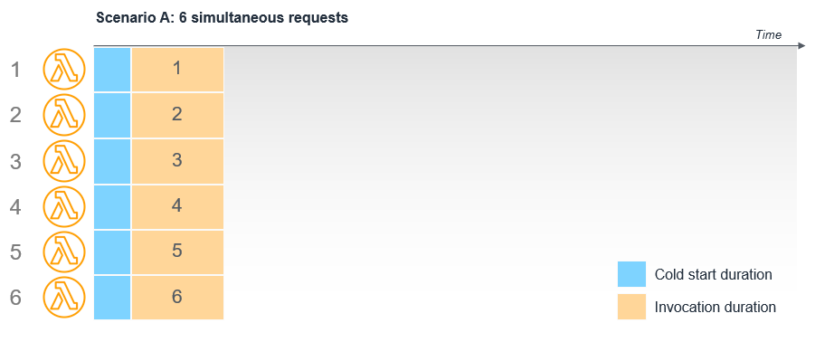

:::notes

If API Gateway invokes Lambda six times simultaneously, this causes Lambda to
create six execution environments. The total duration of each invocation
includes a cold start:

:::

### 6 asynchronous inviations with reserved concurrency 1

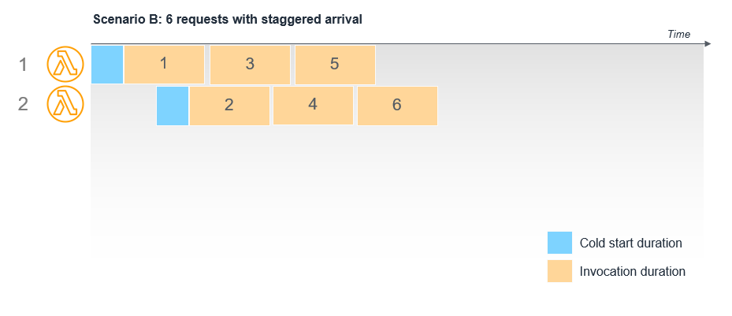

:::notes

However, if API Gateway invokes Lambda 6 times sequentially with a delay between
each invocation, the existing execution environments are reused if the previous
invocation is complete. In this case, only the first two invocations experience
a cold start, while invocations 3 through 6 use warm environments.

:::

### 6 requests with staggered arrival


:::notes

For asynchronous invocations, an internal queue exists between the caller and
the Lambda service. Lambda processes messages from this queue as quickly as
possible and scales up automatically as needed. In the event that the function
uses reserved concurrency, this acts as a maximum capacity, so the internal
queue retains the messages until the function can process them.

For example, an S3 bucket is configured to invoke a Lambda function when objects
are written to the bucket, if the reserved capacity of the Lambda function is
set to 1 and 6 objects are written to the bucket simultaneously, the events are
processed sequentially by a single execution environment. Pending events are
maintained in the internal queue.

:::

### Cold start times

[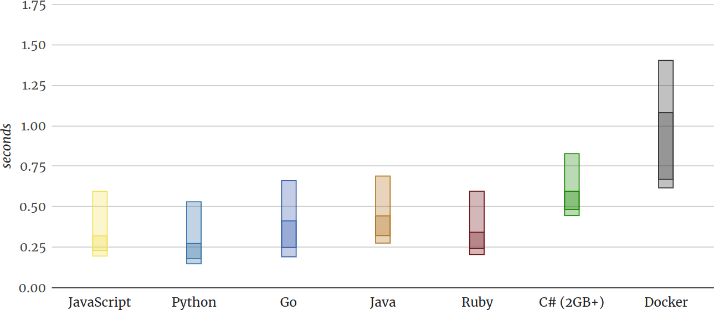](https://mikhail.io/serverless/coldstarts/aws/languages/)

- typically <1% of invocations in production deployments

:::notes

According to an analysis of production Lambda workloads, cold starts typically
occur in under 1% of invocations. The duration of a cold start varies from under
100 ms to over 1 second. Since the Lambda service optimizes internally based
upon invocation patterns for functions, cold starts are typically more common in
development and test functions than production workloads. This is because
development and test functions are usually invoked less frequently. Overall, the
Lambda service optimizes the execution of functions across all customers to
reduce the number of cold starts.

Source:
https://aws.amazon.com/blogs/compute/operating-lambda-performance-optimization-part-1/

Chart source: https://mikhail.io/serverless/coldstarts/aws/languages/

:::

### Cold start mitigation

- reserved concurrency (keep _n_ instances alive all the time)
- reduce cold start time:
  - reduce deployment artifact size
  - chose _leaner_ execution environment
  - give more resources to Lambda (RAM)
  - reduce start up time (e.g. DB connections)
  - reduce processing run time

## IoT <3 _serverless_

### No **world**

- Many, many devices, that don't share global state.

### 18+ billion IoT devices this year

- Needs to scale to billions of devices, connections, message per day.

:::notes

https://www.ericsson.com/en/about-us/company-facts/ericsson-worldwide/india/authored-articles/ushering-in-a-better-connected-future

:::

### Data for thousands of use cases

- Many different operations with different business needs (processing) on small
  datasets, suits serverless microservice model very well.

### Architecture Example: store and retrieve temperature data

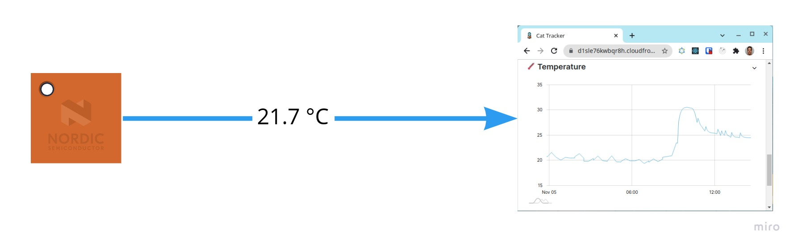

[miro.com/app/board/o9J_llBJjJM=](https://miro.com/app/board/o9J_llBJjJM=/)

### AWS implementation

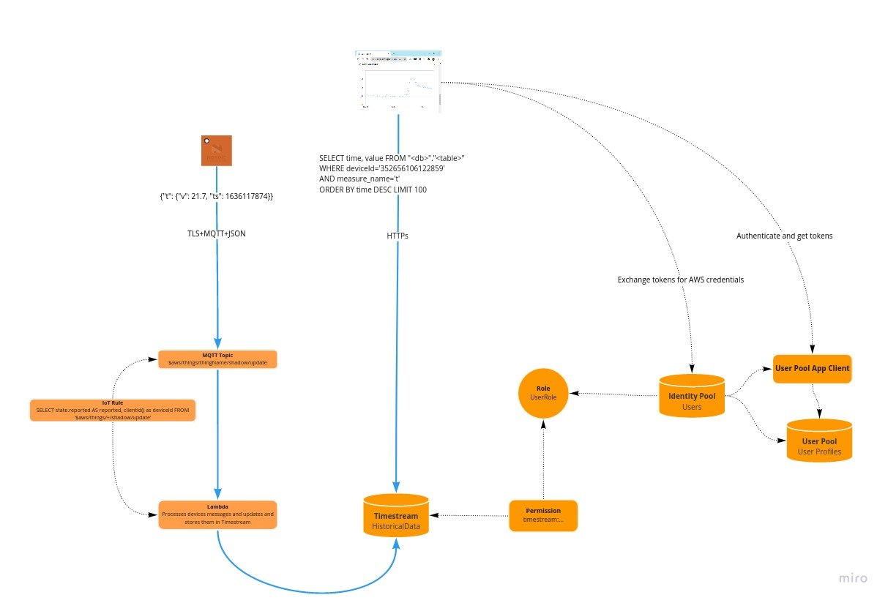{width=80%}

## Learning resources

### Book recommendations

- [REST in Practice](http://shop.oreilly.com/product/9780596805838.do)
- [ACCELERATE](https://itrevolution.com/book/accelerate/)

### Cellular IoT development

- [Best practices for cellular IoT development](https://infocenter.nordicsemi.com/topic/nwp_044/WP/nwp_044/intro.html)
  (Whitepaper)
- [nRF Connect SDK fundamentals](https://academy.nordicsemi.com/courses/nrf-connect-sdk-fundamentals/)
  (Online course)

## Thank you & happy connecting!

Please share your feedback!

<small>[Markus.Tacker@NordicSemi.no](mailto:Markus.Tacker@NordicSemi.no)  
[\@coderbyheart](https://twitter.com/coderbyheart)</small>

<small>Latest version:  
[`bit.ly/awsiotarch`](https://bit.ly/awsiotarch)</small>

We are hiring!  
[nordicsemi.com/jobs](https://nordicsemi.com/jobs)  
<small>Trondheim &middot; Oslo &middot; 20+ more locations</small>
